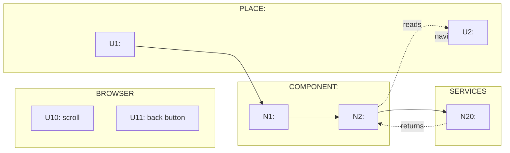

# Wiring diagram template (Mermaid)

Use this when the output will be read in a Markdown renderer that supports Mermaid.

Conventions:

- **Solid** edges (`-->`) = wires out (calls / triggers / writes)
- **Dashed** edges (`-.->`) = returns and reads (return values / store reads)

## Tips

- Start with the “happy path” flow.
- Add pagination/scroll/back-button after the core search/load wiring is clear.
- If the graph gets busy, split into multiple Mermaid diagrams per place.
