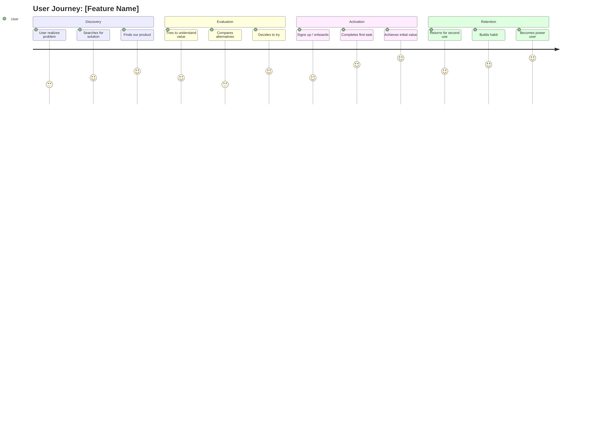
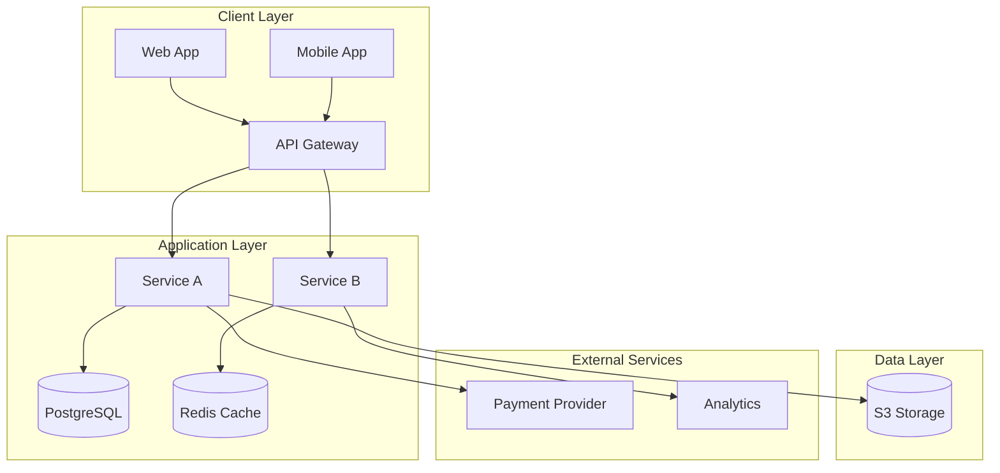
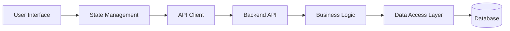
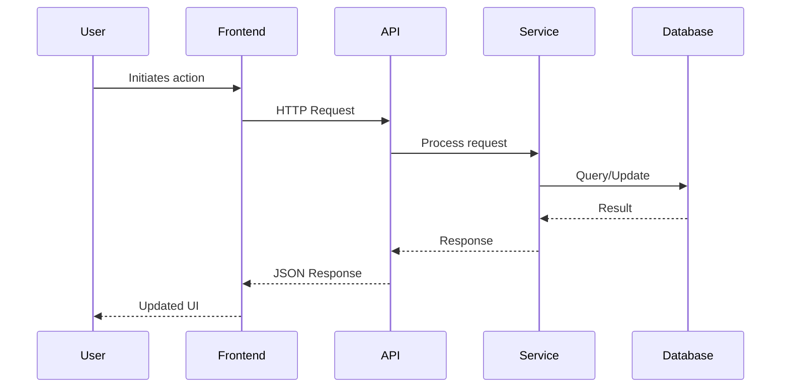
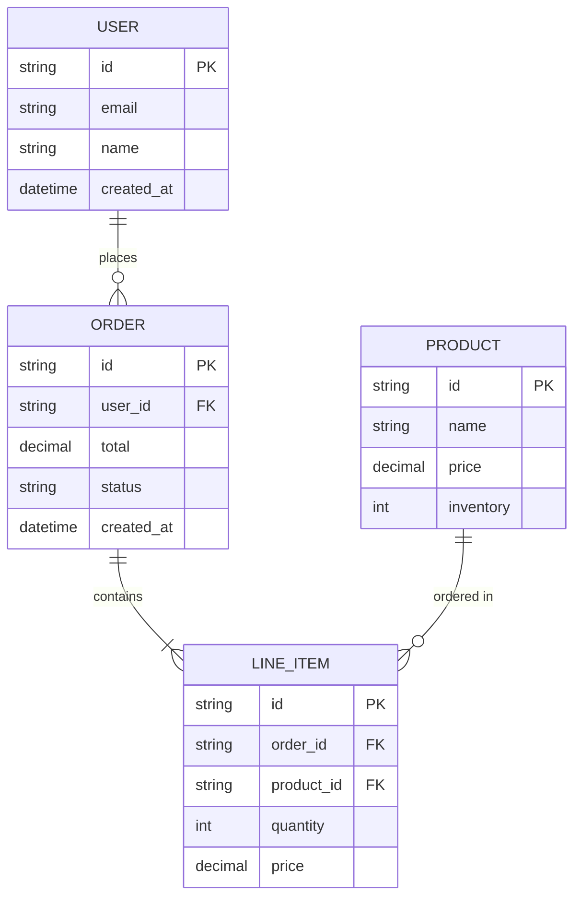
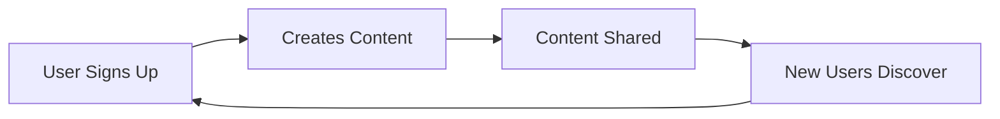

This file contains notes from an initial brainstorming session I had.


# Product Requirements Document Framework

  

A comprehensive framework for creating product documentation that combines business strategy, user experience, technical architecture, and growth considerations.

  

## Document Types

  

### 1. Product Brief (Business Context Focus)

**Length**: 1 pager

**Purpose**: Quick alignment on business opportunity and strategic fit

**Audience**: Executive stakeholders, cross-functional leadership   

Product Strategy 1 pager

This template serves to outline a clear and crisp (1-2 pages tops) strategy document for each pod that will govern the near term roadmap. This document defines the goals of the team, justifies how achieving this goal will help us grow, and outlines the priorities of the team to achieve them. 

Goal → What do you want to see in the world?
Hypothesis → Why do you think this will work?
Right to win → Why are we uniquely positioned to do this?
Metric → How will you measure that it does?
Initiatives → What do we need to do to reach the goal?
Risks → Why would we fail & what should we do about it?
Long Term outcomes → How will this work compound? 
Goal
Define your team’s purpose & north star metric.
Hypothesis
Explain your hypothesis for how we reach our goal - this is the strategy
Right to win
Why do you think we are uniquely positioned to accomplish this goal vs. everyone else
Metrics
Link to dashboards. Limit to 3 metrics tops. Define the metric, the value, and commentary on the status (red/yellow/green)
Initiatives
Define a prioritized list of initiatives to achieve these goals. Limit to 3-4 initiatives per goal
Goal
Initiatives(s)


Key Risks
Key Risk
Mitigant(s)


Long Term Outcomes
What are the long term outcomes that will build on top of this work for our competitive advantage in the market? 
Further Reading
Links 

We hope this template is useful for you and your teams. If you have any input please DM me @geoffintech. We’re always on the lookout for incredible talent - check out our jobs board. Ty


  

### 2. Full PRD (Product Requirements Document)

**Length**: 2-6 pages (varies by scope). Cap at 6 pages in length

**Purpose**: Comprehensive product specification and implementation guide

**Audience**: Engineering, design, product, and QA teams

  

### 3. PRFAQ (Product Requirements FAQ)

**Length**: 0.5-1 page

**Purpose**: Concise, question-driven product overview

**Audience**: Broad stakeholder communication

  

---

  

## Product Brief Template

  

### Executive Summary

- **Problem Statement**: What user/business problem are we solving?
- **Opportunity Size**: Market size, revenue potential, strategic value
- **Proposed Solution**: High-level approach in 2-3 sentences
- **Success Metrics**: Key outcomes we're targeting

  

### Business Context
- **Strategic Alignment**: How this fits our company strategy
- **Competitive Landscape**: What competitors are doing, our differentiation
- **Market Timing**: Why now is the right time
- **Business Model Impact**: Revenue, cost, or strategic positioning implications

  

### Customer Insights

- **Target Customer**: Who is this for? (personas, segments)

- **Jobs to be Done**: What are customers trying to accomplish?

- **Current Alternatives**: What do they use today? What are the pain points?

- **Value Proposition**: Why will customers choose our solution?

  

### Go-to-Market Considerations

- **Positioning** (April Dunford framework):
- Competitive alternatives
- Unique features
- Value (what's the benefit?)
- Target market characteristics
- Market category
- **Distribution Strategy**: How will customers discover and adopt this?
- **Pricing Implications**: Impact on current or future pricing

  

### Success Criteria

- **North Star Metric**: The one metric that matters most

- **Leading Indicators**: Early signals of success/failure

- **Business Impact**: Expected impact on revenue, retention, acquisition

  

### Open Questions & Risks

- **Assumptions to Validate**: What needs to be true for this to succeed?
- **Key Risks**: Technical, market, competitive, organizational
- **Decision Points**: What decisions need to be made?

  

---

  

## Full PRD Template

  

### 1. Overview

  

#### Problem Statement

**User Problem**: Clear description of the user pain point or opportunity
**Business Problem**: Why this matters to the business
**Evidence**: Data, user research, or market insights that validate this problem

  

#### Goals & Success Metrics
- **North Star Metric**: Primary measure of success
- **Supporting Metrics**: Secondary KPIs that drive the north star
- **Anti-Metrics**: What we explicitly don't want to happen
- **Success Criteria**: Specific, measurable targets

  

#### In Scope / Out of Scope

**In Scope**:
- Feature/capability A
- Feature/capability B
- Feature/capability C

  

**Out of Scope** (and why):
- Future consideration X
- Explicitly not doing Y
- Beyond current phase: Z

  

#### Success Criteria

Define what "done" looks like:
- [ ] Functional requirements met
- [ ] User acceptance criteria achieved
- [ ] Performance benchmarks hit
- [ ] Launch metrics goals
  

---

  

### 2. User Experience


#### User Personas

For each primary persona:
- **Who**: Demographics, role, context
- **Goals**: What they're trying to accomplish
- **Pain Points**: Current frustrations
- **Behaviors**: How they currently solve this problem

#### User Journey Mapping

Map the complete user journey, including emotional state:
  



  

**Journey Stages** (expand each):

1. **Awareness**: How do users discover they have this problem?
- Emotional state: [frustrated, confused, hopeful]
- Actions: [searching, asking peers, etc.]
- Opportunities: Where can we help?

  

2. **Consideration**: How do they evaluate solutions?
- Emotional state: [skeptical, curious, overwhelmed]
- Actions: [comparing options, reading reviews]
- Opportunities: How do we stand out?

  

3. **Activation**: First-time use experience
- Emotional state: [excited, nervous, impatient]
- Actions: [onboarding, first task, setup]
- Opportunities: How do we get to value fast?

  

4. **Retention**: Ongoing use
- Emotional state: [satisfied, productive, loyal]
- Actions: [regular use, exploring features]
- Opportunities: How do we deepen engagement?

  

#### User Stories & Acceptance Criteria
Format: As a [persona], I want to [action], so that [benefit]


**Epic**: [High-level capability]


**User Story 1**:

- As a [persona]
- I want to [capability]
- So that I can [outcome]

  

**Acceptance Criteria**:
- [ ] Given [context], when [action], then [expected result]
- [ ] Given [context], when [action], then [expected result]
- [ ] Edge case: [scenario] → [expected behavior]

  

---

  

### 3. UX Design (Nielsen Norman Heuristics)

Apply the 10 usability heuristics to the design:


#### 1. Visibility of System Status
- How does the system keep users informed about what's happening?
- Loading states, progress indicators, confirmations


#### 2. Match Between System and Real World
- Does the interface speak the user's language?
- Are metaphors and concepts familiar?

  

#### 3. User Control and Freedom
- Can users easily undo/redo actions?
- Are there clear "emergency exits"?
- Can users cancel long-running operations?

  

#### 4. Consistency and Standards
- Does it follow platform conventions?
- Is terminology consistent?
- Do similar actions work the same way?

  

#### 5. Error Prevention
- How do we prevent errors before they happen?
- Constraints, confirmations, good defaults

  

#### 6. Recognition Rather Than Recall
- Are options visible vs. requiring memorization?
- Is context provided where needed?


#### 7. Flexibility and Efficiency of Use
- Are there shortcuts for power users?
- Can the interface adapt to different skill levels?

  

#### 8. Aesthetic and Minimalist Design
- Is every element purposeful?
- Have we removed unnecessary information?

  

#### 9. Help Users Recognize, Diagnose, and Recover from Errors
- Are error messages clear and constructive?
- Do they suggest solutions?

  

#### 10. Help and Documentation
- Is contextual help available?
- Are complex features documented?

  

---

  

### 4. Technical Architecture


#### System Architecture

Use Mermaid diagrams to illustrate:




  

#### Component Architecture



  

#### Data Flow



  

#### Technical Requirements

- **Performance**: Response time targets, throughput requirements
- **Scalability**: Expected load, scaling strategy
- **Security**: Authentication, authorization, data protection
- **Reliability**: Uptime targets, error handling, monitoring
- **Compatibility**: Browser support, device support, API versions

  

#### Data Model



  

---

  

### 5. Growth Considerations

  
#### Growth Model (Brian Balfour Framework)

**Growth Loops** - Identify self-reinforcing growth mechanisms:

  



  

**Loop Analysis**:

- **Input**: What starts the loop?
- **Action**: What does the user do?
- **Output**: What's created that feeds the loop?
- **Feedback**: How does output create new input?

  

#### B2B Growth Strategy

- **Ideal Customer Profile (ICP)**:
- Company size, industry, tech stack
- Pain points, budget, buying process
- Decision makers and influencers

  

- **Acquisition Channels**:
- Outbound: Sales development, partnerships
- Inbound: Content, SEO, product-led growth
- Community: Events, user groups, advocacy

  
- **Sales Motion**:
- Self-serve, sales-assisted, or enterprise sales?
- Free trial, freemium, or demo-driven?
- Sales cycle length and key stages


#### B2C Growth Strategy
- **User Acquisition**:
- Paid channels (CAC targets)
- Organic channels (virality, SEO, social)
- Referral programs

  

- **Activation**:

- Aha moment: What creates immediate value?

- Time to value: How quickly can users get there?

- Onboarding flow optimization

  

- **Retention**:

- Usage frequency (daily, weekly, monthly)

- Engagement loops and habit formation

- Churn analysis and prevention

  

- **Monetization**:

- Pricing model (subscription, usage, transaction)

- Willingness to pay and price sensitivity

- Upgrade paths and revenue expansion

  

#### Key Metrics (Pirate Metrics - AARRR)

- **Acquisition**: How do users find us?

- CAC (Customer Acquisition Cost)

- Traffic sources and conversion rates

  

- **Activation**: Do they have a great first experience?

- % completing onboarding

- Time to first value

- Completion of key activation events

  

- **Retention**: Do they come back?

- Day 1, 7, 30 retention

- Monthly Active Users (MAU)

- Churn rate

  

- **Revenue**: How do we make money?

- LTV (Lifetime Value)

- LTV:CAC ratio

- Average Revenue Per User (ARPU)

  

- **Referral**: Do they tell others?

- Viral coefficient (K-factor)

- Net Promoter Score (NPS)

- Referral rate

  

---

  

### 6. Launch Planning

  

#### Phased Rollout

- **Phase 0 - Internal Alpha**: Team testing, bug fixes

- **Phase 1 - Closed Beta**: Selected users, gather feedback

- **Phase 2 - Open Beta**: Broader audience, monitor metrics

- **Phase 3 - General Availability**: Full launch

  

#### Launch Checklist

**Product Readiness**:

- [ ] Core functionality complete and tested

- [ ] Performance benchmarks met

- [ ] Security review complete

- [ ] Analytics instrumented

- [ ] Error monitoring configured

  

**Go-to-Market Readiness**:

- [ ] Marketing materials prepared

- [ ] Sales enablement complete

- [ ] Support documentation ready

- [ ] Customer success playbooks created

- [ ] Pricing and packaging finalized

  

**Operational Readiness**:

- [ ] Monitoring and alerting configured

- [ ] Incident response plan documented

- [ ] Scaling plan in place

- [ ] Rollback procedure tested

- [ ] On-call schedule established

  

#### Communication Plan

- **Internal**: How/when do we inform the team?

- **Beta Users**: Early access, feedback loops

- **All Users**: Launch announcement, change management

- **External**: Press, partners, community

  

---

  

### 7. Dependencies & Risks

  

#### Dependencies

- **Technical Dependencies**: APIs, infrastructure, third-party services

- **Team Dependencies**: Design, legal, security, data science

- **External Dependencies**: Partners, vendors, regulatory approval

  

#### Risks & Mitigation

| Risk | Likelihood | Impact | Mitigation Strategy |

|------|------------|--------|---------------------|

| Technical complexity exceeds estimates | Medium | High | Spike work, early prototyping |

| Low user adoption | Medium | High | User research, beta testing |

| Competitive response | Low | Medium | Fast iteration, moat building |

  

#### Open Questions

- [ ] Question 1 - Owner: [Name] - Due: [Date]

- [ ] Question 2 - Owner: [Name] - Due: [Date]

  

---

  

### 8. Appendix

  

#### Research & References

- User research findings

- Market analysis

- Competitive analysis

- Technical spike results

  

#### Glossary

- **Term 1**: Definition

- **Term 2**: Definition

  

#### Revision History

| Version | Date | Author | Changes |

|---------|------|--------|---------|

| 0.1 | YYYY-MM-DD | Name | Initial draft |

| 1.0 | YYYY-MM-DD | Name | Incorporated feedback |

  

---

  

## PRFAQ Template (Amazon-style)

  

### Product Overview

**What is [Product Name]?**

[2-3 sentence description of the product and what it does]

  

### Customer Problem

**What problem does this solve?**

[Describe the customer pain point clearly and concisely]

  

### Why Now?

**Why is this the right time to build this?**

[Market timing, technology enablement, or strategic opportunity]

  

### How It Works

**How does [Product Name] work?**

[Simple explanation of the user experience]

  

### Customer Benefits

**What are the key benefits?**

- Benefit 1: [Specific, measurable outcome]

- Benefit 2: [Specific, measurable outcome]

- Benefit 3: [Specific, measurable outcome]

  

### Differentiation

**How is this different from alternatives?**

[Clear articulation of unique value]

  

### Success Metrics

**How will we measure success?**

- Metric 1: [Target]

- Metric 2: [Target]

- Metric 3: [Target]

  

### Launch Timeline

**When will this be available?**

[Target launch date and key milestones]

  

### Customer Quote (Aspirational)

> "[Fictional quote from ideal customer describing the impact]"

> — [Customer Type/Persona]

  

---

  

## Framework Applications

  

### John Cutler Principles

- **Outcomes over outputs**: Focus on impact, not features shipped

- **Continuous improvement**: Instrument, measure, iterate

- **Systems thinking**: Consider second-order effects

- **Evidence-based**: Data and user research inform decisions

  

### Brian Balfour Growth Principles

- **Product-market fit first**: Growth amplifies what's working

- **Growth loops over funnels**: Self-reinforcing mechanisms

- **Retention before acquisition**: Keep who you have

- **Sustainable growth**: Build moats, not just momentum

  

### April Dunford Positioning Framework

1. **Understand the alternatives**: What else would customers consider?

2. **Identify unique features**: What can you do that alternatives can't?

3. **Map features to value**: Why do those features matter?

4. **Characterize target customers**: Who cares most about this value?

5. **Define market category**: What context makes your value obvious?

  

### Elena Verner PLG Principles

- **Product is the primary driver of acquisition, conversion, expansion**

- **User experience drives business outcomes**

- **Data-informed iteration and experimentation**

- **Align incentives across product, growth, and revenue teams**

  

---

  

## Usage Guidelines

  

1. **Start with the right document type**:

- Early exploration? → Product Brief

- Ready to build? → Full PRD

- Need broad communication? → PRFAQ

  

2. **Adapt to your context**:

- Not all sections apply to all products

- Adjust depth based on complexity and risk

- Iterate based on feedback

  

3. **Collaborate early and often**:

- Share drafts, don't perfect in isolation

- Include engineering in scoping

- Validate with users throughout

  

4. **Keep it alive**:

- PRDs should evolve as you learn

- Update based on implementation realities

- Document key decisions and changes

  

5. **Focus on "why"**:

- The "what" will change

- The "why" keeps teams aligned

- Make reasoning explicit

  

---

  

## Example Prompts for Claude

  

### Generate a Product Brief

```

Using the Product Brief template from the PRD Framework, help me create a product brief for [product/feature idea].

  

Context:

- Target customer: [description]

- Problem: [problem statement]

- Our company: [brief description]

- Strategic priority: [why this matters]

  

Please ask me clarifying questions about business context, market opportunity, and success criteria, then draft a comprehensive Product Brief.

```

  

### Generate a Full PRD

```

Using the Full PRD template, help me create a comprehensive PRD for [product/feature].

  

Include:

- User journey mapping with emotional states

- Mermaid architectural diagrams

- UX design considerations using Nielsen Norman heuristics

- Growth strategy (this is a [B2B/B2C] product)

- Technical requirements and data models

  

Context:

[Provide relevant context about the product, users, and goals]

```

  

### Generate a PRFAQ

```

Using the PRFAQ template, help me create a concise product FAQ for [product/feature].

  

This is for [audience] and should focus on [key aspects].

  

Context:

[Provide brief product description and key benefits]

```

  

---

  

## Additional Resources

  

### Recommended Reading

- **"Obviously Awesome"** by April Dunford (Positioning)

- **"Hacking Growth"** by Sean Ellis & Morgan Brown (Growth)

- **"Inspired"** by Marty Cagan (Product Management)

- **"The Mom Test"** by Rob Fitzpatrick (Customer Research)

- **"Don't Make Me Think"** by Steve Krug (UX Design)

  

### Online Resources

- **John Cutler**: [newsletter, blog] on product thinking

- **Brian Balfour**: Reforge content on growth

- **Nielsen Norman Group**: UX research and heuristics

- **Lenny's Newsletter**: Product and growth insights

  

### Tools

- **Mermaid Live Editor**: mermaid.live for diagram creation

- **User Journey Mapping**: Optimal Workshop, Miro, FigJam

- **Product Analytics**: Amplitude, Mixpanel, PostHog

- **User Research**: Dovetail, UserTesting, Maze
