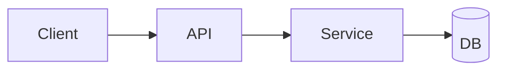

# Shape Workflow

## Purpose

Transform ideas into actionable PRDs/specs with a user journey and an architecture sketch.

## Inputs

<feature_idea> #$ARGUMENTS </feature_idea>

If the feature idea is empty, ask: "What feature or product idea should I shape?"

## Workflow

1. **Clarify scope**
   - Target users, problem statement, and success metrics
   - Constraints, dependencies, and timelines
   - Non-goals and out-of-scope items

2. **Gather context**
   - Read `AGENTS.md` for stack and conventions
   - Scan `docs/` for related plans, solutions, or standards
   - Identify existing components or APIs to reuse

3. **Define requirements**
   - User stories and key use cases
   - Functional requirements
   - Non-functional requirements (perf, security, reliability)
   - Acceptance criteria

4. **Map user journey**
   - Happy path steps
   - Key edge cases and error states

5. **Sketch architecture**
   - Components, data flow, integrations
   - API endpoints and data model changes
   - Rollout/feature flags if needed

6. **Identify risks and open questions**
   - Technical risks, unknowns, and decision points

## Output Format

````markdown
# PRD: [Feature Title]

## Overview

[One-paragraph summary]

## Goals

- Goal 1
- Goal 2

## Non-Goals

- Non-goal 1

## Target Users

- Persona or segment

## Requirements

### User Stories
- As a [user], I want [capability], so that [benefit]

### Functional Requirements
- [Requirement]

### Non-Functional Requirements
- Performance: [target]
- Security: [notes]

## User Journey

1. Step 1
2. Step 2
3. Step 3

## Architecture Sketch



## Data Model / API Changes

- [Model change]
- [Endpoint]

## Acceptance Criteria

- [ ] Criterion 1
- [ ] Criterion 2

## Risks & Open Questions

- Risk or question
````

## Verification

- Includes goals + non-goals
- User journey is present (happy path + key edges)
- Architecture sketch provided
- Acceptance criteria are testable
- Risks/open questions captured

## Examples

**Invocation:** `/prompts:wf-shape "Team inbox with SLA alerts"`

**Excerpt:**
````markdown
## User Journey
1. Support lead configures SLA thresholds
2. System flags tickets nearing breach
````

## Invocation

- **Codex:** `/prompts:wf-shape`
- **Claude:** `/wf-shape`
